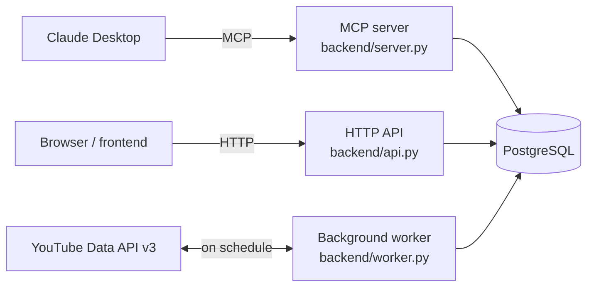

# niche-finder

[](https://github.com/pandich93/niche-finder/actions/workflows/ci.yml)
[](assets/coverage.json)
[](LICENSE)
[](backend/Dockerfile)
[](backend/interfaces/http/api.py)
[](docker-compose.yml)
[](docker-compose.yml)
[](backend/interfaces/mcp/server.py)
[](https://github.com/pandich93/niche-finder/commits/main)

A self-hosted alternative to NexLev / vidIQ / ViewStats: find niches, viral
videos from small channels, trending categories and keywords over arbitrary
periods (24h, 48h, 7/30/90 days), plus full channel tracking and analytics.
Runs on the free YouTube Data API v3 and a local PostgreSQL — no
subscription, no paid LLM key: semantic classification like "faceless / on
topic" is done by the model calling these tools, not the server.


The project has two parts that together make up the "product":

- **`backend/`** — Python: an MCP server (24 tools for Claude), an HTTP API
  for the dashboard, and a background worker that logs view/subscriber
  history on a schedule (without this, "growth rate over 24 hours" doesn't
  exist — the YouTube API only ever returns "right now").
- **`frontend/`** — the same functionality, but visual: a dashboard built on
  plain ES modules (no npm, no build step) that calls the backend's HTTP API.

Both parts and the Postgres store come up together with one command (see
below) — the dashboard and Claude Desktop end up looking at the same
database.

## Features

- Find viral videos and outlier channels by niche over an arbitrary period
  (24h / 48h / 7 / 30 / 90 days)
- Trending categories and keywords, best time to publish, title patterns
- Track specific channels: view/subscriber growth rate, snapshot history
- The exact same calculation in Claude Desktop (via MCP) and on the web
  dashboard — one shared codebase, not two implementations
- Only the free YouTube Data API v3 and local PostgreSQL — no paid
  subscriptions and no LLM key on the server side

## Table of Contents

- [Screens](#screens)
- [How it works](#how-it-works)
- [Quick start](#quick-start)
- [Repository layout](#repository-layout)
- [Contributing](#contributing)
- [Changelog](#changelog)
- [Read next](#read-next)

## Screens

<table>
<tr>
<td width="50%"><br><sub>Viral videos — small channels that overperformed expectations</sub></td>
<td width="50%"><br><sub>Outlier channels — best video's multiplier against the channel's median</sub></td>
</tr>
<tr>
<td width="50%"><br><sub>Categories — share and growth across YouTube niches</sub></td>
<td width="50%"><br><sub>Keywords — trendScore, lift, momentum</sub></td>
</tr>
<tr>
<td width="50%"><br><sub>Channel tracker — collect and follow specific channels</sub></td>
<td width="50%"><br><sub>Niches — everything collected under user-defined labels</sub></td>
</tr>
<tr>
<td width="50%"><br><sub>Data — database state and manual collection/refresh</sub></td>
<td width="50%"></td>
</tr>
</table>

## How it works



The MCP server, HTTP API, and worker are three different entry points into
the same code: all three call the same use cases from `backend/application/`,
so the result in Claude Desktop and on the dashboard is literally the same
calculation — not two separate implementations. A detailed breakdown of the
backend's layers (as of September 5, 2026 — DDD: domain → infrastructure →
application → interfaces) is in
[backend/README.md](backend/README.md#structure).

## Quick start

With Docker (recommended — brings up Postgres, the worker, and the dashboard
together):

```bash
cp .env.example .env          # fill in YOUTUBE_API_KEY (not required to build)
docker compose build
make up                       # or: docker compose up -d web worker
make doctor                   # check the key, network, and database
open http://localhost:8080    # dashboard
```

Without Docker (needs your own reachable Postgres):

```bash
make local-install            # venv + backend dependencies, once
make dev                      # HTTP dashboard on http://localhost:8080
make local-run                # or: MCP server on the host, for Claude Desktop
```

`make help` prints every available command with a one-line description.

## Repository layout

| Path | What's inside |
|---|---|
| [`backend/`](backend/README.md) | MCP server, HTTP API, worker — all the logic and data storage |
| [`frontend/`](frontend/README.md) | dashboard: index.html, styles.css, ui.js, app.js |
| `docker-compose.yml` | postgres + worker + web + mcp/mcp-http services |
| `Makefile` | commands to run everything, via Docker or straight on the host |
| `.env.example` | YouTube key and worker settings |
| `scripts/mcp-docker.sh` | MCP server launcher in Docker for Claude Desktop |

`docs/` (decision history and market research) — internal notes, not
included in this repository.

## Contributing

Bug reports, bug fixes, and documentation PRs are welcome — for anything
bigger (a new MCP tool, API endpoint, or dashboard screen), please open an
issue first to agree on the shape. See
[CONTRIBUTING.md](CONTRIBUTING.md) for how to set up a dev environment and
run the test suite.

## Changelog

See [CHANGELOG.md](CHANGELOG.md) for a history of notable changes, in
[Keep a Changelog](https://keepachangelog.com/en/1.1.0/) format.

## Read next

- [backend/README.md](backend/README.md) — YouTube API quotas, all 24 tools
  with descriptions, how to read `period_by`, running with and without
  Docker, the DDD layer structure.
- [frontend/README.md](frontend/README.md) — dashboard screens, where the
  data comes from, how the palette is built.
