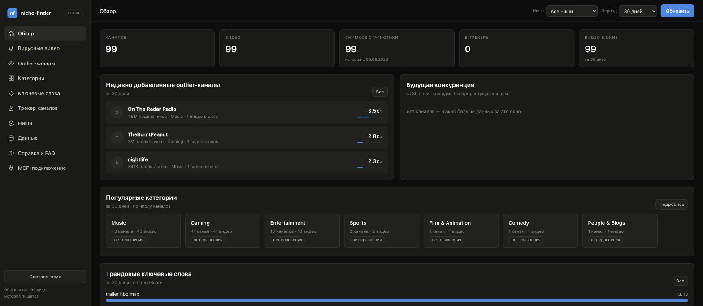
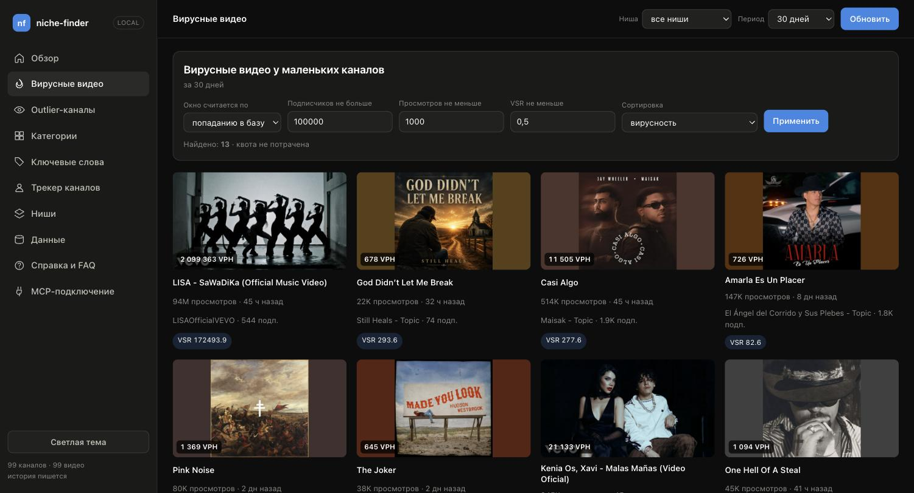
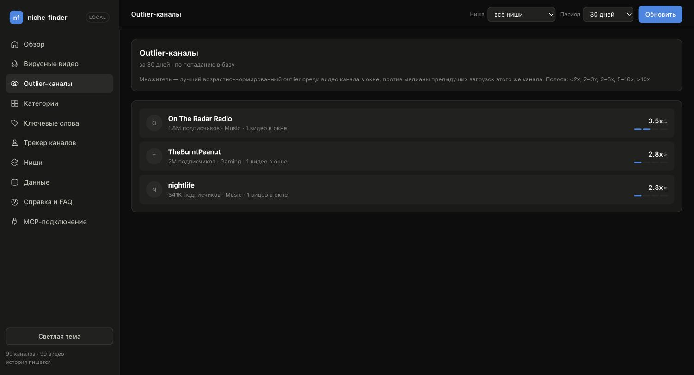
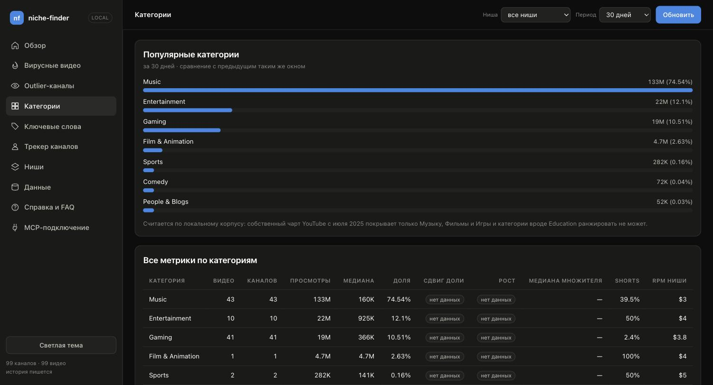
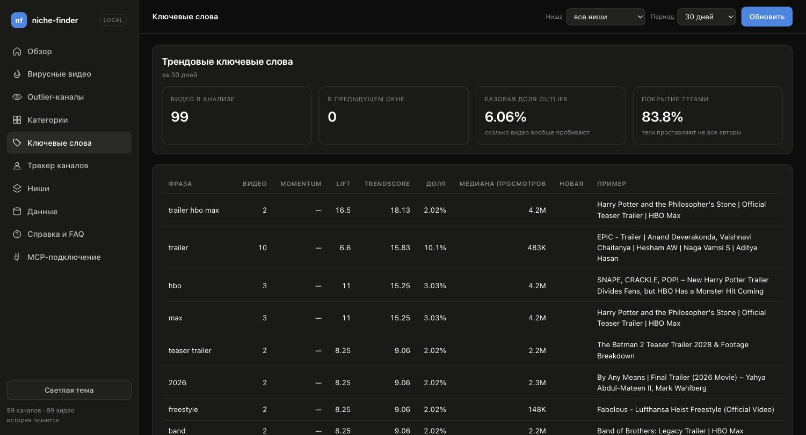
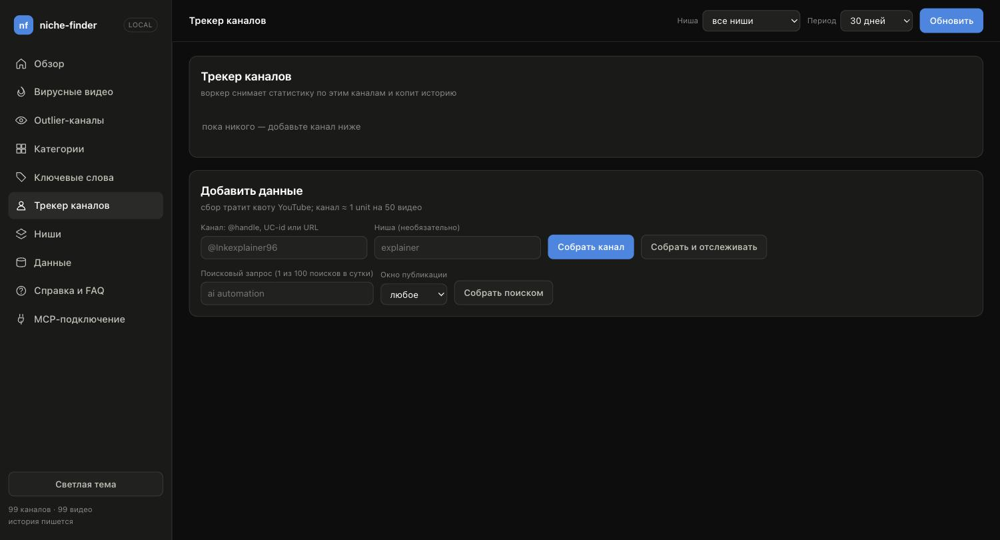
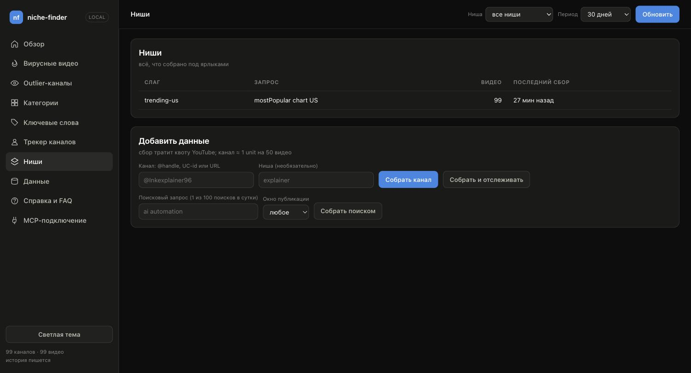
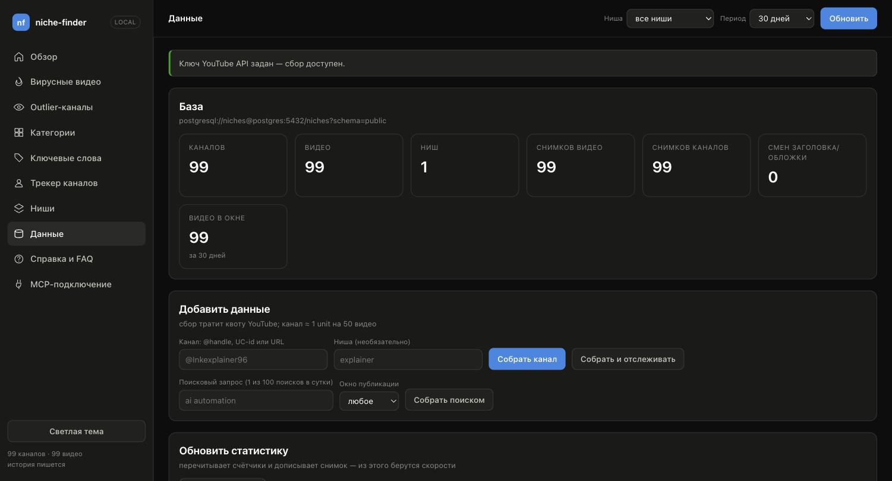
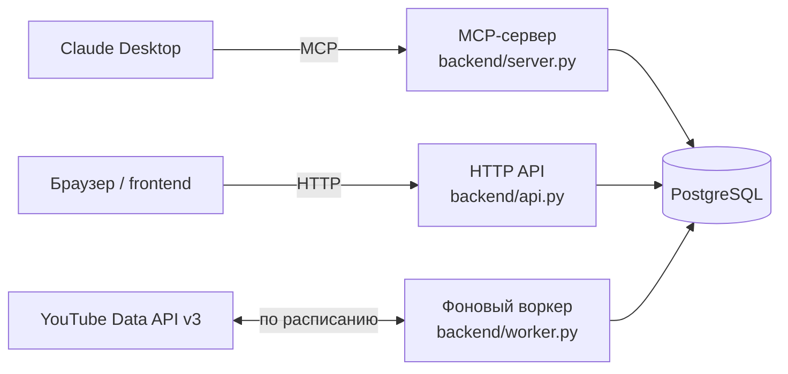

# niche-finder

[](https://github.com/pandich93/niche-finder/actions/workflows/ci.yml)
[](assets/coverage.json)
[](LICENSE)
[](backend/Dockerfile)
[](backend/interfaces/http/api.py)
[](docker-compose.yml)
[](docker-compose.yml)
[](backend/interfaces/mcp/server.py)
[](https://github.com/pandich93/niche-finder/commits/main)

Свой аналог NexLev / vidIQ / ViewStats: поиск ниш, вирусных видео у маленьких
каналов, трендовых категорий и ключевых слов за произвольные периоды (24 часа,
48 часов, 7/30/90 дней), плюс полноценный трекинг и разбор YouTube-каналов.
Работает на бесплатном YouTube Data API v3 и локальном PostgreSQL — никакой
подписки, никакого платного LLM-ключа: классификацию вида «faceless / подходит
по смыслу» делает модель, которая вызывает эти инструменты, а не сервер.



У проекта две части, которые вместе и составляют «продукт»:

- **`backend/`** — Python: MCP-сервер (24 инструмента для Claude), HTTP API
  для дашборда и фоновый воркер, который пишет историю просмотров/подписчиков
  по расписанию (без этого не существует «скорость роста за 24 часа» — YouTube
  API отдаёт только «сейчас»).
- **`frontend/`** — тот же функционал, но глазами: дашборд на чистых ES-модулях
  (без npm и шага сборки), который дёргает HTTP API backend'а.

Обе части и хранилище Postgres запускаются вместе одной командой (см. ниже) —
дашборд и Claude Desktop в итоге смотрят в одну и ту же базу.

## Возможности

- Поиск вирусных видео и outlier-каналов по нише за произвольный период
  (24ч / 48ч / 7 / 30 / 90 дней)
- Трендовые категории и ключевые слова, лучшее время публикации, паттерны
  заголовков
- Трекинг конкретных каналов: скорость роста просмотров/подписчиков, история
  снапшотов
- Один и тот же расчёт в Claude Desktop (через MCP) и на веб-дашборде —
  общая кодовая база, не две реализации
- Только бесплатный YouTube Data API v3 и локальный PostgreSQL — без платных
  подписок и без LLM-ключа на стороне сервера

## Содержание

- [Экраны](#экраны)
- [Как это устроено](#как-это-устроено)
- [Быстрый старт](#быстрый-старт)
- [Структура репозитория](#структура-репозитория)
- [Дальше читать](#дальше-читать)

## Экраны

<table>
<tr>
<td width="50%"><br><sub>Вирусные видео — маленькие каналы, выстрелившие сильнее ожидаемого</sub></td>
<td width="50%"><br><sub>Outlier-каналы — множитель лучшего видео против медианы канала</sub></td>
</tr>
<tr>
<td width="50%"><br><sub>Категории — доля и рост по нишам YouTube</sub></td>
<td width="50%"><br><sub>Ключевые слова — trendScore, lift, momentum</sub></td>
</tr>
<tr>
<td width="50%"><br><sub>Трекер каналов — сбор и отслеживание конкретных каналов</sub></td>
<td width="50%"><br><sub>Ниши — всё, что собрано под пользовательскими ярлыками</sub></td>
</tr>
<tr>
<td width="50%"><br><sub>Данные — состояние базы и ручной сбор/обновление статистики</sub></td>
<td width="50%"></td>
</tr>
</table>

## Как это устроено



MCP-сервер, HTTP API и воркер — это три разных входа в один и тот же код:
все три вызывают одни и те же сценарии из `backend/application/`, поэтому
результат в Claude Desktop и на дашборде — буквально один и тот же расчёт,
а не две отдельные реализации. Подробный разбор слоёв backend'а (с 5 сентября
2026 — DDD: domain → infrastructure → application → interfaces) — в
[backend/README.md](backend/README.md#структура).

## Быстрый старт

Через Docker (рекомендуется — поднимает Postgres, воркер и дашборд разом):

```bash
cp .env.example .env          # впишите YOUTUBE_API_KEY (не обязателен для сборки)
docker compose build
make up                       # или: docker compose up -d web worker
make doctor                   # проверить ключ, сеть и базу
open http://localhost:8080    # дашборд
```

Без Docker (нужен свой доступный Postgres):

```bash
make local-install            # venv + зависимости backend, один раз
make dev                      # HTTP-дашборд на http://localhost:8080
make local-run                # или: MCP-сервер на хосте, для Claude Desktop
```

`make help` печатает все доступные команды с однострочным описанием каждой.

## Структура репозитория

| Путь | Что внутри |
|---|---|
| [`backend/`](backend/README.md) | MCP-сервер, HTTP API, воркер — вся логика и хранение данных |
| [`frontend/`](frontend/README.md) | дашборд: index.html, styles.css, ui.js, app.js |
| `docker-compose.yml` | postgres + worker + web + mcp/mcp-http сервисы |
| `Makefile` | команды запуска что через Docker, что напрямую на хосте |
| `.env.example` | ключ YouTube и настройки воркера |
| `scripts/mcp-docker.sh` | лончер MCP-сервера в Docker для Claude Desktop |

`docs/` (история решений и разбор рынка) — внутренние заметки, в этот
репозиторий не входят.

## Дальше читать

- [backend/README.md](backend/README.md) — квоты YouTube API, все 24
  инструмента с описанием, как читать `period_by`, запуск с Docker и без,
  структура DDD-слоёв.
- [frontend/README.md](frontend/README.md) — экраны дашборда, откуда берутся
  данные, как устроена палитра.
