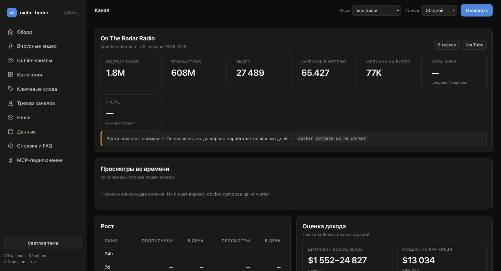

# frontend

Дашборд к niche-finder — то же, что показывает NexLev у себя в Niche Finder,
но по вашей локальной базе и без подписки.

```bash
cd ~/Desktop/projects/youtube/analytic
docker compose build            # добавились fastapi + uvicorn
docker compose up -d web worker
open http://localhost:8080
```

Без Docker (тот же дашборд, тот же `frontend/`, читает файлы отсюда же):

```bash
make local-install   # один раз: venv + зависимости backend
make dev             # uvicorn api:app --reload на http://localhost:8080
```

Подробнее про запуск без Docker — [backend/README.md](../backend/README.md#запуск-без-docker).

## Как устроено

Никакой сборки: обычные ES-модули, никакого npm, `node_modules` и шага build.
Правка файла видна после перезагрузки страницы — папка примонтирована в
контейнер только для чтения, пересобирать образ не нужно.

| Файл | Что внутри |
|---|---|
| `index.html` | каркас: сайдбар, шапка с глобальными фильтрами, контейнер экрана |
| `styles.css` | тёмная и светлая темы, компоненты |
| `ui.js` | форматтеры, тултипы, тосты и компоненты (карточки, таблицы, бары, график) |
| `app.js` | экраны и хеш-роутинг |

Данные берутся из `backend/api.py` (шим над `interfaces/http/api.py`, FastAPI),
который вызывает ровно те же сценарии, что и MCP-сервер. Никакой логики во
фронте нет — все метрики считаются на бэкенде, интерфейс их только показывает.

## Экраны

Глобальные фильтры «Ниша» и «Период» в шапке применяются ко всем экранам и
запоминаются в браузере.

### Обзор

Всё сразу, одним запросом `/api/overview`: outlier-каналы, будущая
конкуренция, категории, ключевые слова, вирусные видео.


### Вирусные видео

Видео маленьких каналов с фильтрами (подписчики, просмотры, VSR, окно
публикации) и воронкой снизу: видно, какой именно порог отсёк результаты, а
не просто пустой список.


### Outlier-каналы

Лучший возрастно-нормированный множитель среди видео канала в окне, против
медианы его предыдущих загрузок. Полосы силы: <2x, 2–3x, 3–5x, 5–10x, >10x.


### Категории

Рейтинг категорий YouTube за период со сдвигом доли против предыдущего окна
такой же длины — можно ранжировать по просмотрам или по числу каналов.


### Ключевые слова

Трендовые фразы: momentum, lift, trendScore, доля видео и медиана просмотров,
с примером видео на каждую фразу.


### Трекер каналов

Вотчлист, по которому воркер копит историю снимков, плюс формы добавления
канала (по handle/URL) или сбора по поисковому запросу.


### Ниши

Всё, что собрано под пользовательскими ярлыками (слаг + исходный запрос),
с числом видео и временем последнего сбора по каждой нише.


### Канал

Детальный разбор одного канала: подписчики, просмотры, медиана на видео,
скорость роста по окнам (24ч/7д/30д) и оценка дохода. График «просмотры во
времени» строится из снимков воркера, потому что YouTube API отдаёт только
состояние «прямо сейчас» — на скрине ниже видно состояние с одним снимком,
до того как график набрал историю.



### Данные

Состояние ключа, базы и истории (сколько каналов/видео/снимков собрано) плюс
те же формы сбора и ручное обновление статистики.


## Безопасность

Сервис слушает `127.0.0.1` — внутри контейнера лежит ваш ключ YouTube, и
выставлять его в локальную сеть незачем. Порт меняется через `WEB_PORT` в
`.env`. POST-эндпоинты (`/api/collect/*`, `/api/refresh`) тратят квоту, GET —
нет.

## Оформление

Палитра — валидированный набор из скилла `dataviz`: магнитуда рисуется одной
серией (синий), поэтому легенда не нужна; статусные цвета применяются только к
дельтам и всегда идут со знаком и подписью, так что смысл никогда не держится
на одном лишь цвете. Тёмная и светлая темы — отдельные наборы значений под свою
подложку, а не автоматическая инверсия.

## API

Схема живая: `http://localhost:8080/api/docs`.
